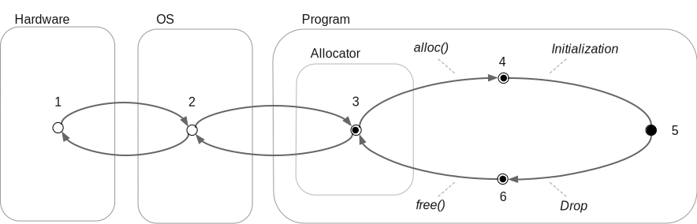

# Initialization

> TODO(timclicks): split this content into multiple sub-sections

---

## Introduction

> All runtime-allocated memory in a Rust program begins its life as
> uninitialized.
>
> &mdash;
> [The Rustonomicon](https://doc.rust-lang.org/nomicon/uninitialized.html)

<details>

This segment of the course describes what _initialization_ is and some of its
related concepts, such as _alignment_ and _validity_, and how they relate to one
that we've seen before: _undefined behavior_.

</details>

---

## What is uninitialized memory?

```rust,editable
fn mystery() -> u32 {
    let x;

    unsafe { x }
}

fn main() {
    let a = mystery();
    println!("{a}")
}
```

<details>

**Question:** What is the value of `a`? **Answer:** We don't know. It's
uninitialized.

</details>

---

## What is uninitialized memory? (cont.)

- Nondeterminism
- Instability
- Nearly zero-cost
- Ubiquity
- Unsafe to read from
- Safe to write to

<details>

- **Nondeterminism**. It's impossible to assume which bits will be present when
  read (although some platforms do provide their own guarantees).
- **Instability**. Reading the same uninitialized byte multiple times can
  produce different values.
- **Nearly zero-cost**. Because zeroing bytes or performing other pre-flight
  checks before use is not mandated, utilizing uninitialized memory with care
  can offer performance optimizations.
- **Ubiquity**. All memory starts its life as uninitialized.
- **Unsafe to read from**. Reading from uninitialized memory immediately
  triggers _undefined behavior_.
- **Safe to write to**. Programs may write bytes to the memory region. This
  allows programmers to overwrite the uninitialized bytes with values that are
  guaranteed to be valid.

[Playground](https://play.rust-lang.org/?version=stable&mode=debug&edition=2024&gist=651684ebcb9c5f46c74b60af94bc1b9a)

</details>

---

## Memory life cycle



<details>

_States in the diagram:_

Memory is ...

1. Non-paged. Memory pages are created on-demand by the OS.
2. Mapped but not allocated. Hardware addresses are mapped to virtual addresses.
3. Allocated. The program’s allocator takes responsibility for the memory.
4. Allocated and "available" (uninitialized).
5. Allocated and "active" (initialized). Reachable from Safe Rust.
6. An object’s lifetime has finished, but the memory has not yet been reclaimed
   by the allocator.

_Discussion:_

- In the previous example, `x` is in state _4_. Safe Rust requires all variables
  to be in state _5_ at all times.
- To move from state 4 to 5, you must write overwrite the uninitialized bytes
  with values that are guaranteed to be valid. To do this, use `MaybeUninit`,
  which we'll introduce in detail next.
- To move from state 5 to 6, rely on Rust's borrow checker. State 6 is not
  visible code.

</details>

---

## Introducing `std::mem::MaybeUninit`

```rust,editable
fn mystery() -> u32 {
    let x;

    x
}

fn main() {
    let a = mystery();
    println!("{a}")
}
```

<details>

### Discussion

Because Safe Rust requires all memory to be _initialized_, but memory always
starts as _uninitialized_, there must be some mechanism provided by the language
to allow programmers to initialize memory. That is the job provided by
`std::mem::MaybeUninit`.

## Demo

Task: Alter the example so that it compiles by introducing `MaybeUninit` as a
way for Rust programs to refer to uninitialized memory.

Suggested change:

```rust
use std::mem::MaybeUninit;

fn mystery() -> u32 {
    let x: u32 = unsafe { MaybeUninit::uninit().assume_init() };

    x
}

fn main() {
    let a = mystery();
    println!("{a}")
}
```

Emphasize that this code compiles and runs, but calling `mystery()` immediately
triggers _undefined behavior_.

[Playground](https://play.rust-lang.org/?version=stable&mode=debug&edition=2024&gist=e722f3f7bbe204280426e750a305b1c8)

## Demo - Part 2

Introduce the `::zeroed()` static method to increase determinism.

```rust
fn mystery() -> u32 {
    let x: u32 = unsafe { MaybeUninit::zeroed().assume_init() };

    x
}
```

[Playground](https://play.rust-lang.org/?version=stable&mode=debug&edition=2024&gist=163f0a5379859626f25875427ef0af41)

## Demo - Part 3

Write a defined, valid, value to the memory taken by `MaybeUninit`.

```rust
fn mystery() -> u32 {
    let x unsafe { 
        let mut bytes = MaybeUninit::uninit();
        std::ptr::write(bytes.as_mut_ptr(), 42u32);
        bytes.assume_init()
    }

    x
}
```

</details>

[Playground](https://play.rust-lang.org/?version=stable&mode=debug&edition=2024&gist=a44f06541bbd1ac1d5cc4c186e43255a)

---

## Case study: selective initialization

```rust
use std::mem::MaybeUninit;

/// A sparse on-stack array that is quick to create because it doesn't worry about initializing the underlying memory
pub struct ArrayFastBuilder<const N: usize, T: Default> {
    data: [MaybeUninit<T>; N],
    initialized: [bool; N],
    count: usize,
}

impl<const N: usize, T: Default> ArrayFastBuilder<N, T> {
    pub fn new() -> Self {
        Self {
            data: unsafe { MaybeUninit::uninit().assume_init() },
            initialized: [false; N],
            count: 0,
        }
    }

    pub fn set(&mut self, index: usize, value: T) -> Result<(), &'static str> {
        if index >= N {
            return Err("Index out of bounds");
        }

        if !self.initialized[index] {
            self.count += 1;
        }

        self.data[index] = MaybeUninit::new(value);
        self.initialized[index] = true;
        Ok(())
    }

    pub fn get(&self, index: usize) -> Option<&T> {
        if index < N && self.initialized[index] {
            Some(unsafe { self.data[index].assume_init_ref() })
        } else {
            None
        }
    }

    pub fn count(&self) -> usize {
        self.count
    }

    pub fn into_array(self) -> [T; N] {
        let mut result: [MaybeUninit<T>; N] =
            unsafe { MaybeUninit::uninit().assume_init() };

        for i in 0..N {
            result[i] = if self.initialized[i] {
                unsafe { std::ptr::read(&self.data[i]) }
            } else {
                MaybeUninit::new(T::default())
            };
        }

        unsafe {
            std::ptr::read(&result as *const [MaybeUninit<T>; N] as *const [T; N])
        }
    }

    pub fn into_sparse_vec(self) -> Vec<(usize, T)> {
        let mut result = Vec::with_capacity(self.count);

        for (i, is_init) in self.initialized.iter().enumerate() {
            if *is_init {
                let value = unsafe { std::ptr::read(&self.data[i]).assume_init() };
                result.push((i, value));
            }
        }

        result
    }
}
```

<details>

Discussion:

You've been given this code to review.

A sparse on-stack array that is quick to create because it doesn't worry about
initializing the underlying memory

Here is an application of what we just saw. `ArrayFastBuilder` reserves space on
the stack for the contents, but skips avoids zeroing that array when it is
created.

</details>

---

## What is the contract?

Whenever we're creating unsafe code, we need to consider what the contract is.

What does `assume_init(self)` mean? What do we need to do to guarantee that
initialization it is no longer an assumption.

<details>

What is this code asking of us? What are the expectations that we need to
satisfy? If we don't know the expectations, where would we find them?

</details>

---

## Layout guarantees

The following program runs successfully for `u64` values. Is that the case for
all possible types `T`?

```rust,editable
use std::mem::MaybeUninit;

fn main() {
    
    let u = MaybeUninit<u64>::uninit();

    assert_eq!(size_of::<MaybeUninit<u64>>(), size_of::<u64>());
    assert_eq!(align_of::<MaybeUninit<u64>>(), align_of::<u64>());    
}
```

Look through the documentation for `MaybeUninit` to verify your assumptions.

<details>

Another way to ask this is to check whether guarantees does `MaybeUninit<T>`
provide about its memory layout?

Here is [the relevant quote][q] from the Layout section of the docs:

> `MaybeUninit<T>` is guaranteed to have the same size, alignment, and ABI as
> `T`.

[q]: https://doc.rust-lang.org/std/mem/union.MaybeUninit.html#layout-1

</details>

---

## What about safety when panicking?

```rust
```

<details>

Rust's drop behavior presents a challenge during panics. In situations where
there is partially-initiated values, dropping causes undefined behavior.

</details>

---

## Questions for review

Where should the safety comment be? What kinds of tests can we perform. Fuzzing.

---

## Exercise: Vec<T>

Look up the documentation for `assume_init` and describe why this creates
undefined behavior:

```rust
use std::mem::MaybeUninit;

fn main() {
    let x = MaybeUninit::<Vec<u32>>::uninit();
    let x_ = unsafe { x.assume_init() };

    println!("{x_:?}")
}
```

<details>

Many types have additional invariants that need to be upheld. For example,
`Vec<T>` has a different representation when it's first created with `::new()`
compared to after its first entry is inserted. It lazily allocates memory and
there is no allocation involved until space is actually needed.

From the [doc comment of `assume_init()`][docs]:

> It is up to the caller to guarantee that the `MaybeUninit<T>` really is in an
> initialized state. Calling this when the content is not yet fully initialized
> causes immediate undefined behavior. The type-level documentation contains
> more information about this initialization invariant.
>
> On top of that, **remember that most types have additional invariants beyond
> merely being considered initialized at the type level**. For example, a
> 1-initialized `Vec<T>` is considered initialized (under the current
> implementation; this does not constitute a stable guarantee) because the only
> requirement the compiler knows about it is that the data pointer must be
> non-null. Creating such a `Vec<T>` does not cause immediate undefined
> behavior, but will cause undefined behavior with most safe operations
> (including dropping it).
>
> _Emphasis added_

[docs]: https://doc.rust-lang.org/std/mem/union.MaybeUninit.html#method.assume_init

### Extension exercise

Ask the class to think of other types that require special handling:

- `char` outside the range of a Unicode scalar
  (`[0x0000..=0xD7FF, 0xE000..=0x10FFFF]`)
- References, (NULL is a valid pointer, but not a valid reference)
- Types backed by `Vec<_>`, including `String`.
- Pinned types, i.e. `Pin<T>`
- Non-zero types, i.e. `NonZeroU32`, etc

</details>

---

## MaybeUninit use case: initializing a struct field by field

```rust
use std::mem::MaybeUninit;
use std::ptr::addr_of_mut;

#[derive(Debug, PartialEq)]
pub struct FileFormat {
    marker: [u8; 4],
    len: u32,
    data: Vec<u8>,
}

fn main() {
    let rfc = {
        let mut uninit: MaybeUninit<Foo> = MaybeUninit::uninit();
        let ptr = uninit.as_mut_ptr();

        unsafe {
            addr_of_mut!((*ptr).name).write([b'R', b'F', b'C', b'1']);
        }

        unsafe {
            addr_of_mut!((*ptr).len).write(3);
        }

        unsafe {
            addr_of_mut!((*ptr).list).write(vec![0, 1, 2]);
        }

        unsafe { uninit.assume_init() }
    };

    assert_eq!(
        rfc,
        FileFormat {
            name: b"RFC1",
            len: 3
            data: vec![0, 1, 2]
        }
    );
}
```

---

## Use case: partial initialization

```rust,editable
use std::mem::MaybeUninit;

const SIZE: usize = 10_000_000;

fn with_zeroing() -> Vec<u8> {
    let mut vec = vec![0u8; SIZE];
    for i in 0..SIZE {
        vec[i] = (i % 256) as u8;
    }
    vec
}

fn without_zeroing() -> Vec<u8> {
    let mut vec = Vec::with_capacity(SIZE);
    unsafe {
        let ptr = vec.as_mut_ptr();
        for i in 0..SIZE {
            ptr.add(i).write((i % 256) as u8);
        }
        vec.set_len(SIZE);
    }
    vec
}
```

<details>

</details>
````
